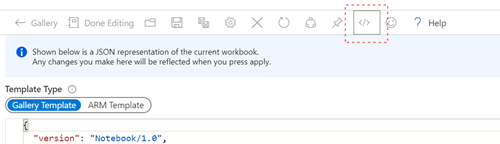

## Workbooks
Workbooks provided here are samples of what is possible to address specific scenarios.

To use any of the workbooks found here, create a new workbook in Azure Monitor, and copy the code from this sample into the code area for the workbook, replacing the sample code in this workbook:

## Daily checks automation

`scripts/daily_checks/` is a standalone Python CLI that pulls team workload
from ServiceNow and security posture from Microsoft Sentinel/Defender and
Armis into a single morning report. See
[scripts/daily_checks/README.md](scripts/daily_checks/README.md) for setup.

## HECVAT coverage gap

`scripts/hecvat_gap/` cross-references HECVAT security assessments (from
ServiceNow tickets) against software actually in use (from Armis) and
CMDB, to flag software that's never been assessed or whose assessment has
gone stale. Works off manual CSV/xlsx exports, no API access required. See
[scripts/hecvat_gap/README.md](scripts/hecvat_gap/README.md) for setup.